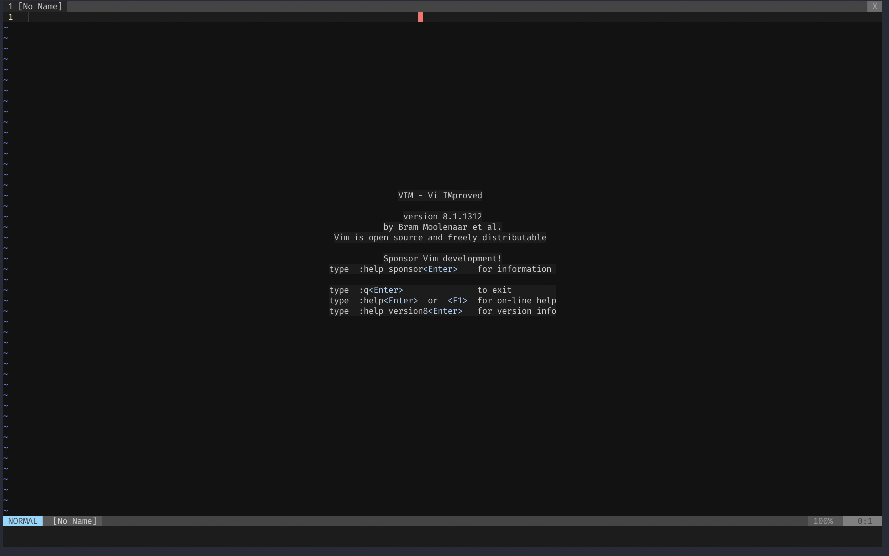
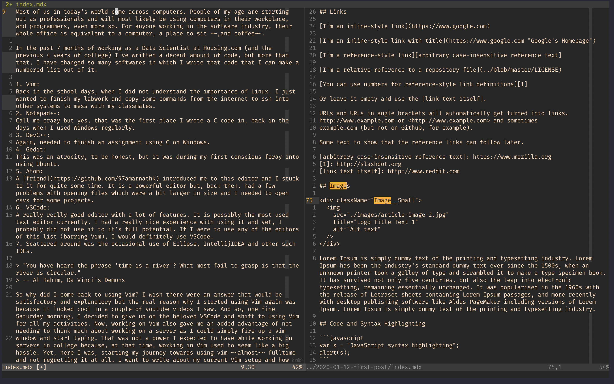
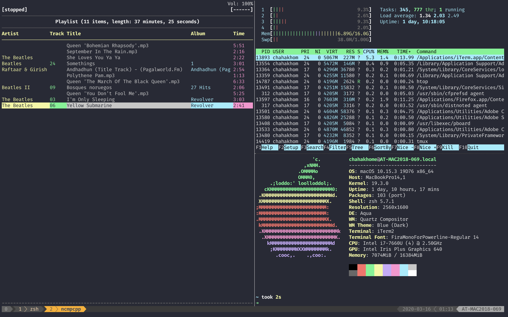

# dotfiles

This repository will contain all the dotfiles that I use for my working setup. The aim for doing this is to maintain a portable configuration that can be set up on any machine.

## Screenshots

### Vim

### Tmux

